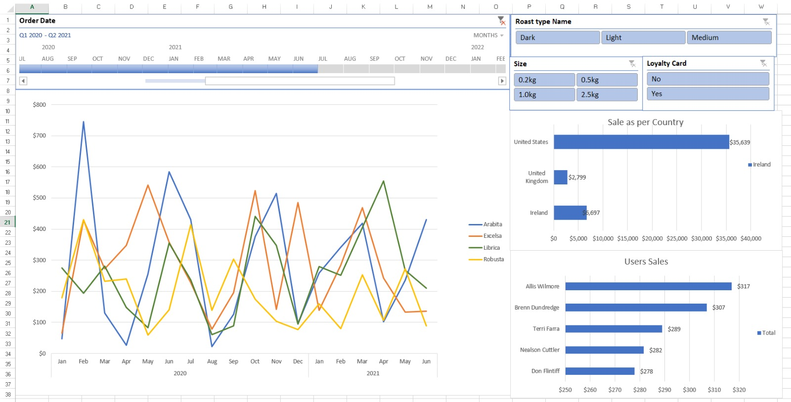

# Excel Data Analysis Project 📊

## 📁 Project Overview
This project demonstrates data analysis using **Microsoft Excel**. The dataset contains [your topic, e.g., sales data, customer orders, or marketing metrics], and the workbook includes data cleaning, pivot tables, visual charts, and a final interactive dashboard.

This project is a part of my learning journey in data analytics and showcases my ability to derive insights using Excel.

## 🧰 Tools & Techniques Used
- Microsoft Excel
- Pivot Tables & Pivot Charts
- Conditional Formatting
- Excel Formulas: `IF`, `VLOOKUP`, `SUMIFS`, `COUNTIFS`
- Interactive Dashboards (Slicers, Timelines)

## 📊 Dashboard Preview

> The dashboard provides insights such as:
> - Trends over time
> - Product/category performance
> - Regional sales comparisons
> - Top N analysis (e.g., top 5 products/customers)

